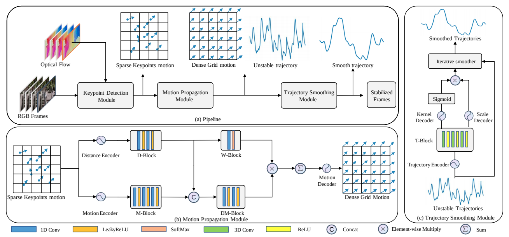
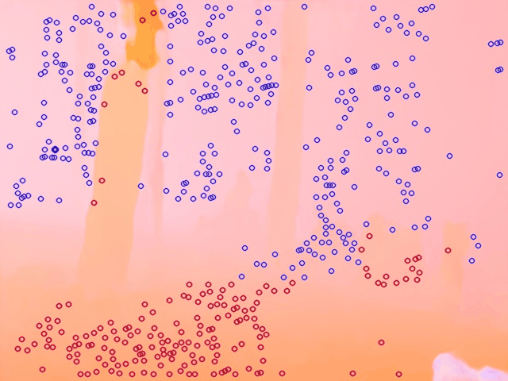
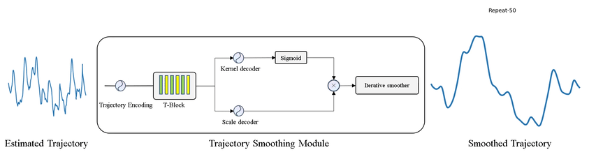

<h1 align="left">DUT: Learning Video Stabilization by Simply Watching Unstable Videos <a href="https://arxiv.org/pdf/2011.14574.pdf">.svg" ></a>  </h1> 

  <a href="#introduction">Introduction</a> |
  <a href="#results-demo">Results Demo</a> |
  <a href="#installation">Installation</a> |
  <a href="#inference-code">Inference Code</a> |
  <a href="#news">News</a> |
  <a href="#statement">Statement</a> |
  <a href="#reference">Reference</a>

## Introduction

This repository contains the code, models, test results for the paper <a href="https://arxiv.org/pdf/2011.14574.pdf">DUT: Learning Video Stabilization by Simply Watching Unstable Videos</a>. It contains a keypoint detetcion module for robust keypoint detection, a motion propagation module for grid-based trajectories estimation, and a trajectory smoothing module for dynamic trajectory smoothing. The DUT model is totally unsupervised and just need unstable videos for training.

We have released the inference code, a pretrained model, which can be found in section <a href="#inference-code"><i>inference code</i></a> for more details. The inference code for DIFRINT and StabNet are also included in this repo.

## Results Demo

We test DUT on the NUS dataset and provide a result overview below (odd rows for unstable inputs and even rows for stabilized videos).

For the motion propagation module, we propose a multi-homography estimation strategy instead of directly using RANSAC for single homography estimation to deal with multiple planes cases. The outliers recognized by RANSAC and the multi-planes identified with the multi-homography strategy are as follows:

The trajectory smoothing module predicts dynamic kernels for iterative smoothing according to the trajectories themselves, the smoothing process can be viewed below:

## Installation
Requirements:

- Python 3.6.5+
- Pytorch (version 1.4.0)
- Torchvision (version 0.5.0)

1. Clone this repository

    `git clone https://github.com/Annbless/DUTCode.git`

2. Go into the repository

    `cd DUTCode`

3. Create conda environment and activate

    `conda create -n DUTCode python=3.6.5`

    `conda activate DUTCode`

4. Install dependencies
    
    `conda install pytorch==1.4.0 torchvision==0.5.0 cudatoolkit=10.1 -c pytorch`

    `pip install -r requirements.txt`

Our code has been tested with Python 3.6.5, Pytorch 1.4.0, Torchvision 0.5.0, CUDA 10.1 on Ubuntu 18.04.

## Inference Code

Here we provide the procedure of testing on sample videos by our pretrained models:

1. Download <a href="https://drive.google.com/drive/folders/15T8Wwf1OL99AKDGTgECzwubwTqbkmGn6?usp=sharing">pretrained model</a> and unzip them to ckpt folder

2. Put clipped frames from unstable videos in the images folder (we have provided one example in the folder)

3. Run the stabilization script

    `chmod +x scripts/*`

    `./scripts/deploy_samples.sh`

4. The results of our DUT, DIFRINT, and StabNet are provided under the results folder

## News
- [x] release inference code for the DUT model;
- [x] include inference code for the DIFRINT model, thanks to <a href="https://github.com/jinsc37">jinsc37</a>;
- [x] include pytorch version StabNet model, thanks to <a href="https://github.com/cxjyxxme">cxjyxxme</a>;
- [ ] include traditional stabilizers in python;
- [ ] release metrics calculation code;
- [ ] release training code for the DUT model;

## Statement
This project is for research purpose only, please contact us for the licence of commercial use. For any other questions please contact [yuxu7116@uni.sydney.edu.au](mailto:yuxu7116@uni.sydney.edu.au).

## Reference

- <a href="https://github.com/jinsc37/DIFRINT">DIFRINT</a>
- <a href="https://github.com/cxjyxxme/deep-online-video-stabilization-deploy">StabNet (tensorflow version)</a>
